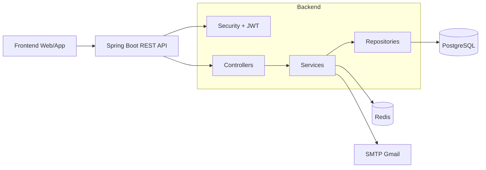
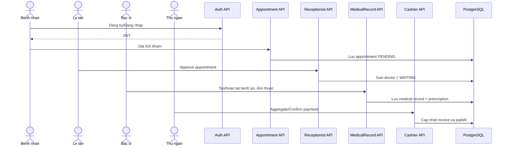

# He thong Quan ly Phong kham - Tong hop chuc nang va luong hoat dong

## 1) Tong quan hien trang

He thong backend duoc xay dung bang Spring Boot va dang van hanh theo mo hinh phan quyen JWT voi cac role:

- ADMIN
- RECEPTIONIST
- DOCTOR
- CASHIER
- PATIENT

Nghiep vu dang co:

- Xac thuc, dang ky benh nhan, quen mat khau OTP qua email.
- Le tan duyet/tu choi lich hen, quan ly waiting queue.
- Bac si kham benh, tao benh an, quan ly don thuoc va ket qua dich vu.
- Thu ngan xu ly thanh toan, in bien lai, xuat PDF, tra cuu lich su giao dich.
- Admin quan tri user, phong kham, thuoc, dich vu, dashboard va bao cao doanh thu.

## 2) Nen tang ky thuat

- Java 17
- Spring Boot 3.5.13
- Spring Data JPA
- Spring Security + JWT
- PostgreSQL (runtime database)
- Redis (luu OTP quen mat khau, cooldown/rate-limit)
- JavaMailSender (SMTP Gmail)
- OpenAPI/Swagger UI
- Apache PDFBox (xuat hoa don PDF)

## 3) Kien truc tong the

He thong theo kien truc phan lop:

- Controller: endpoint REST.
- Service: nghiep vu.
- Repository: truy van CSDL.
- Entity + DTO: domain model va payload vao/ra.
- Security/JWT: xac thuc va phan quyen.
- Redis + SMTP: thanh phan ha tang cho OTP va thong bao.

### So do kien truc

## 4) Phan quyen endpoint theo role

Theo SecurityConfig hien tai:

- Public:
  - /api/auth/\*\*
  - /v3/api-docs/\*\*
  - /swagger-ui/\*\*
  - /swagger-ui.html
- ADMIN:
  - /api/admin/\*\*
- RECEPTIONIST, ADMIN:
  - /api/appointments/\*\*
  - /api/receptionist/\*\*
- DOCTOR, ADMIN:
  - /api/medical-records/\*\*
- CASHIER, ADMIN:
  - /api/invoices/\*\* (reserved)
- CASHIER:
  - /api/cashier/\*\*
- DOCTOR:
  - /api/doctors/\*\*
- PATIENT:
  - /api/patient/\*\*

## 5) Cac module nghiep vu

### 5.1 Auth va OTP quen mat khau

- Dang nhap: POST /api/auth/login
- Dang ky benh nhan: POST /api/auth/register/patient
- Quen mat khau:
  - POST /api/auth/forgot-password/send-otp
  - POST /api/auth/forgot-password/verify-otp
  - POST /api/auth/forgot-password/reset

Dac diem:

- OTP luu tren Redis co TTL.
- Co cooldown va gioi han tan suat gui OTP.
- Co gioi han so lan nhap OTP sai.
- Gui OTP qua email.

### 5.2 Benh nhan

- GET /api/patient/profile
- POST /api/patient/appointments
- GET /api/patient/appointments
- PUT /api/patient/appointments/{appointmentId}/cancel
- GET /api/patient/medical-records
- GET /api/patient/medical-records/{medicalRecordId}

### 5.3 Le tan

- GET /api/receptionist/appointments/today
- GET /api/receptionist/appointments/from-booking
- GET /api/receptionist/doctors/by-specialty
- PUT /api/receptionist/appointments/{appointmentId}/approve
- PUT /api/receptionist/appointments/{appointmentId}/assign-doctor
- GET /api/receptionist/appointments/waiting
- PUT /api/receptionist/appointments/{appointmentId}/waiting-status
- PUT /api/receptionist/appointments/{appointmentId}/cancel

Ghi chu:

- Khi approve: chuyen trang thai sang WAITING va gui email thong bao cho benh nhan.
- Khi cancel boi le tan: chuyen sang CANCELLED_BY_CLINIC va gui email kem ly do tu choi.

### 5.4 Bac si va benh an

- GET /api/doctors
- GET /api/doctors/me/waiting-patients
- PUT /api/doctors/{doctorId}/clinic-room
- GET /api/doctors/appointments/{appointmentId}/patient-history
- GET /api/doctors/appointments/{appointmentId}/patient-history/{medicalRecordId}

Medical Record API:

- GET /api/medical-records
- GET /api/medical-records/{id}
- GET /api/medical-records/appointment/{appointmentId}
- POST /api/medical-records
- POST /api/medical-records/doctor
- POST /api/medical-records/{medicalRecordId}/prescription-details
- GET /api/medical-records/{medicalRecordId}/prescription-details
- POST /api/medical-records/{medicalRecordId}/service-results
- GET /api/medical-records/{medicalRecordId}/prescription-workspace
- GET /api/medical-records/{medicalRecordId}/medicine-catalog
- POST /api/medical-records/{medicalRecordId}/prescription-details/quick-add
- PUT /api/medical-records/{medicalRecordId}/prescription-details/{medicineId}
- PUT /api/medical-records/{medicalRecordId}/prescription-details/{medicineId}/autosave
- DELETE /api/medical-records/{medicalRecordId}/prescription-details/{medicineId}
- POST /api/medical-records/{medicalRecordId}/prescription-save
- PUT /api/medical-records/{medicalRecordId}/complete
- PUT /api/medical-records/{id}
- DELETE /api/medical-records/{id}

### 5.5 Thu ngan

- GET /api/cashier/payment-queue
- GET /api/cashier/payment-records/search
- GET /api/cashier/invoices/{invoiceId}/paid-detail
- GET /api/cashier/transaction-history
- GET /api/cashier/invoices/by-medical-record
- POST /api/cashier/invoices/aggregate
- PUT /api/cashier/invoices/{invoiceId}/confirm-payment
- POST /api/cashier/invoices/{invoiceId}/process-payment
- GET /api/cashier/invoices/{invoiceId}/receipt
- POST /api/cashier/invoices/{invoiceId}/print-receipt
- GET /api/cashier/invoices/{invoiceId}/export-pdf

### 5.6 Admin

- GET /api/admin/dashboard
- GET /api/admin/revenue-report
- GET /api/admin/revenue-report/export
- GET /api/admin/users
- POST /api/admin/users
- PUT /api/admin/users/{userId}
- DELETE /api/admin/users/{userId}
- GET /api/admin/rooms
- POST /api/admin/rooms
- PUT /api/admin/rooms/{roomId}
- PUT /api/admin/rooms/{roomId}/assign-doctor
- GET /api/admin/medicines
- POST /api/admin/medicines
- PUT /api/admin/medicines/{medicineId}
- DELETE /api/admin/medicines/{medicineId}
- GET /api/admin/services
- POST /api/admin/services
- PUT /api/admin/services/{serviceId}/price
- DELETE /api/admin/services/{serviceId}

## 6) Luong nghiep vu tong quat

## 7) Cau hinh van hanh

Trong application.properties hien tai:

- CSDL: PostgreSQL
- OTP store: Redis
- Mail: Gmail SMTP
- server.port=8081
- spring.jpa.hibernate.ddl-auto=none

Script ho tro van hanh:

- scripts/start-redis.ps1/.cmd
- scripts/stop-redis.ps1/.cmd
- scripts/migrate-sqlserver-to-postgres.ps1/.cmd

## 8) Luu y cap nhat tai lieu

- Module AI chatbox va endpoint login-legacy khong con trong code hien tai.
- Tai lieu nay can cap nhat lai moi khi co thay doi endpoint, role, hoac script van hanh.
